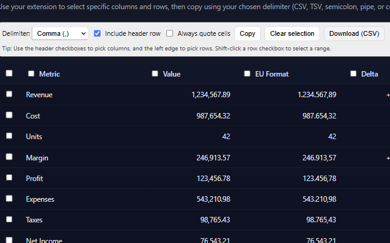

#  Table Exporter to CSV/TSV

**A lightweight Chrome extension to easily select and export HTML table data as CSV or TSV files.**  
Transform any webpage table into clean, structured data — directly in your browser, with zero setup or tracking.

Try the extension in your chrome browser :  [Table Exporter to CSV/TSV](https://chromewebstore.google.com/detail/jkcfpfpibimfnijapboknmknlkalldcd)

---

## 🚀 Overview

**Table Exporter to CSV/TSV** helps you extract tabular data from any webpage quickly and efficiently.  
It overlays an intuitive toolbar above detected HTML tables, allowing you to pick exactly which rows and columns you want to export — then copy them to the clipboard or download them as a CSV or TSV file.

Everything runs locally in your browser — **no data collection, no external servers, and no tracking**.



---

## ✨ Features

- 🧩 Detects tables automatically on any webpage  
- ✅ Select specific rows and columns for export  
- ⚙️ Choose your preferred delimiter: Comma, Tab, Semicolon, Pipe, or Custom  
- 📋 Copy to clipboard or 💾 download as CSV/TSV  
- 🔒 100% privacy-friendly — all operations happen locally  
- 🌐 Works on any site with standard HTML tables  
- 💡 Clean, minimal toolbar interface  

---

## 🖥️ How It Works

1. Install the extension from the Chrome Web Store.  
2. Open any webpage containing one or more HTML tables.  
3. Click the **Table Exporter** icon in your Chrome toolbar.  
4. A small toolbar will appear above each detected table.  
5. Select rows and columns, choose your delimiter, and click **Copy** or **Download (CSV)**.  

Your data is instantly ready to use in Excel, Google Sheets, or your favorite editor.

---

## 🔒 Privacy

This extension:
- Does **not** collect or transmit any user data  
- Does **not** use analytics, ads, or tracking scripts  
- Works entirely offline in your browser  

All processing happens locally — ensuring complete privacy and transparency.

---

## 💡 Roadmap

The initial release focuses on stability and simplicity.  
Planned improvements for future versions include:

- 🔍 Advanced filtering by text or value  
- 📊 Support for multiple table exports at once  
- ⚡ Keyboard shortcuts for faster interaction  
- 🎨 Custom themes and toolbar settings  

Have ideas or suggestions? Feel free to open an [issue](https://github.com/tofaruk/Chrome-Table-Exporter/issues) — community feedback is highly appreciated!

---

## 🧑‍💻 Contributing

Contributions, bug reports, and feature requests are welcome! 🎉  
If you’d like to contribute:

1. **Fork** the repository  
2. **Create** a new branch (`feature/your-feature-name`)  
3. **Commit** your changes  
4. **Open** a Pull Request  

Make sure your code follows the existing style and includes helpful comments or documentation.

---

## 🧰 Development Setup

To build and test locally:

```bash
# Clone the repository
git clone https://github.com/tofaruk/Chrome-Table-Exporter.git
cd Chrome-Table-Exporter

# Install dependencies
npm install

# Build the extension
npm run build
```
## Testing the Extension in Chrome (Development Mode)

Once you’ve built the project, follow these steps to load it into Chrome for testing:

```bash
# Run this command : to automatically build and package your extension into a ZIP file (webstore-upload.zip) ready with only files needed for the chrome 
npm run webstore:zip
```
1. Open Google Chrome and go to: chrome://extensions/
2. Make sure in the top-right corner, toggle Developer mode ON.
3. Click Load unpacked. Browse to your project folder — webstore and unzip the latest unzip directory.  
